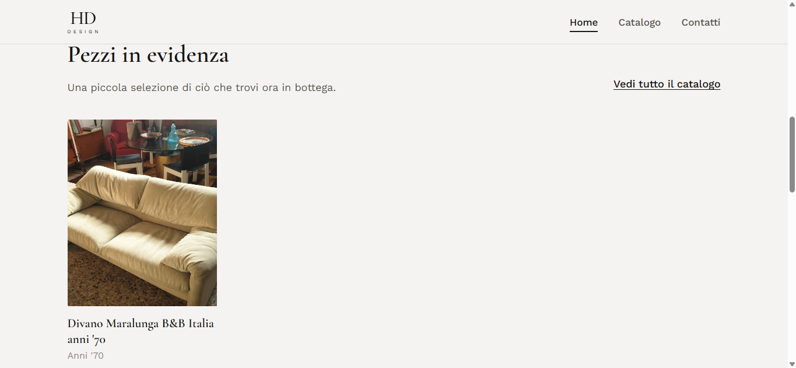
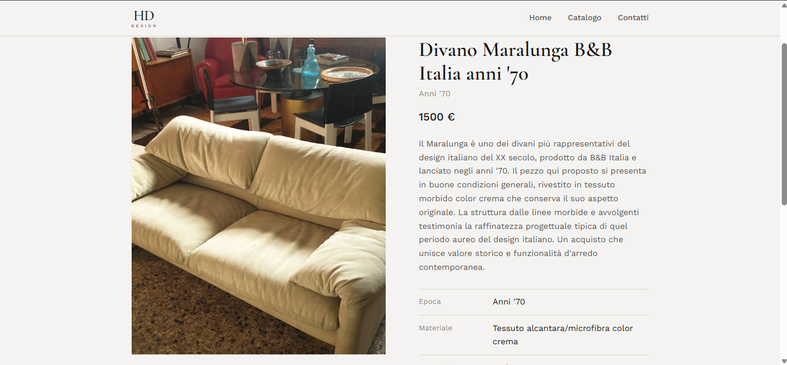
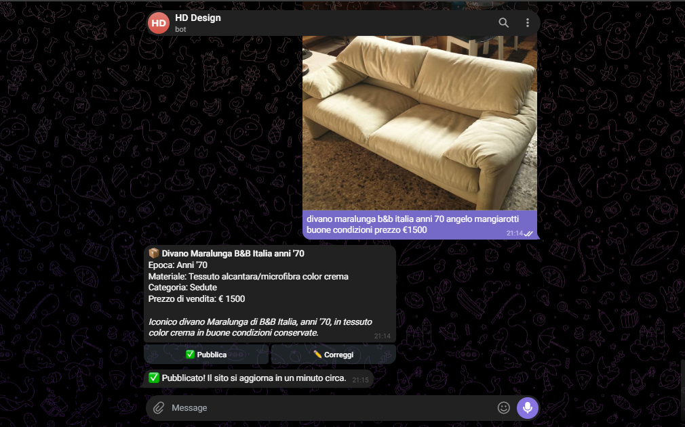
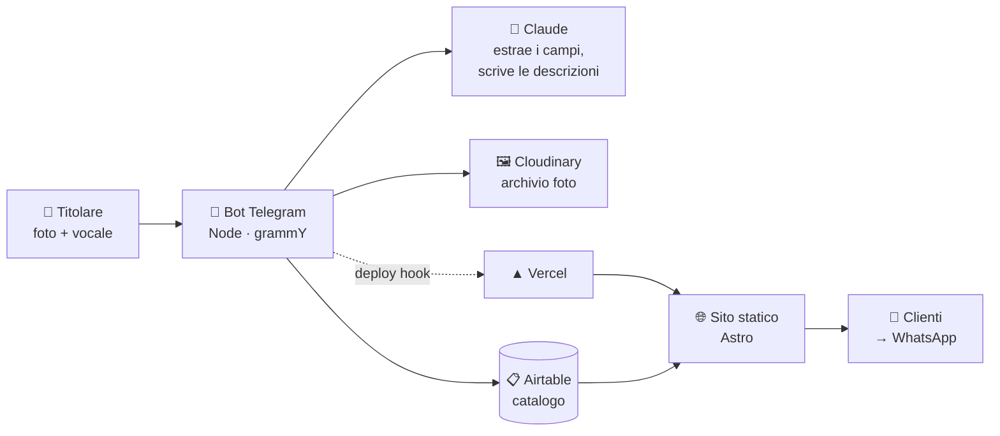

# Vetrina

*[English](README.md) · **Italiano***

[](https://github.com/zalaso/Vetrina/actions/workflows/ci.yml) [](LICENSE)

**Il problema.** Un negoziante con merce da vendere e nessuna voglia di imparare
un'interfaccia — e ogni soluzione pronta ne dà una per scontata.

**La soluzione.** Il pannello di gestione è una chat di Telegram: fotografi un
pezzo, dici due parole, tocchi un bottone. Un minuto dopo è online, con il prezzo
e pronto a ricevere richieste su WhatsApp.

**Stato.** In produzione per una bottega da luglio 2026. Licenza MIT, riutilizzabile.
Guida all'installazione: [inglese](docs/SETUP.md) · [italiano](docs/GUIDA.md).

> **Chi lo usa non deve mai vedere un errore, un modulo da compilare o una
> decisione che non ha chiesto di prendere.**

## Immagini

*Non ancora nel repository — in [docs/img/README.md](docs/img/README.md)
c'è cosa serve e come catturarlo.*

<!-- Quando le tre immagini sono in docs/img/, sostituisci la riga
     qui sopra con questa tabella. Vedi docs/img/README.md.

| La vetrina | Un pezzo | Pubblicare da Telegram |
| --- | --- | --- |
|  |  |  |
-->

## Perché esiste

Da quel vincolo discende ogni regola del bot: le conferme sono
bottoni invece di comandi da scrivere, gli errori sono scuse invece di messaggi
tecnici, e niente cambia sul sito pubblico senza un tocco esplicito.

È nato per un antiquario di settant'anni che non usa il computer e non lo userà
mai. Ogni risposta pronta — un CMS, il pannello di un e-commerce, il modulo di un
marketplace — dà per scontato qualcuno disposto a imparare un'interfaccia. Lui non
lo era, e non c'era motivo perché lo fosse. Mandava però già foto e messaggi vocali
ai familiari tutto il giorno: così il pannello di gestione è diventato una chat di
Telegram, e tutto il resto è stato sistemato dietro.

## Per chi è

Negozi il cui titolare non userà un pannello di amministrazione, e non dovrebbe
doverlo fare: antiquari, usato, piccole gallerie, laboratori di una persona sola —
ovunque la merce si fotografi un pezzo alla volta e si venda parlando, non con un
carrello.

Clonalo e lancia `npm run dev`: ottieni una bottega di esempio completa, con un
catalogo di prova, prima di collegare qualunque cosa.

## Come funziona



Il messaggio arriva come webhook di Telegram. I vocali vengono trascritti con
Whisper; il testo e le foto vanno a Claude, che restituisce i campi strutturati più
una descrizione breve e una lunga, scritte per una galleria e non per un
marketplace. Le foto finiscono su Cloudinary, la scheda su Airtable, e un deploy
hook fa ricompilare il sito.

Il sito pubblico è **completamente statico**. Airtable viene letto durante la
compilazione, quindi il caricamento di una pagina non dipende mai da un servizio
esterno acceso, e tutto viene servito da una CDN.

## Cosa può fare il titolare

Tutto in italiano normale, scritto o parlato, e ogni modifica viene confermata con
un bottone prima di avvenire.

| Dice | Risultato |
| --- | --- |
| *foto* + "comò piemontese, pagato 400, lo vendo a 1200" | Bozza con riepilogo → ✅ Pubblica / ✏️ Correggi |
| "il prezzo è 1000, non 1200" | Corregge la bozza sul posto |
| "venduto il comò" | Segna **venduto** — conta nel guadagno, compare fra i "venduti di recente" |
| "togli la poltrona", "me la tengo", "si è rotta" | Segna **ritirato** — sparisce dal sito, **non** conta come vendita |
| "cambia la foto della credenza" | Aspetta la foto nuova, la sostituisce o la aggiunge |
| "cosa ho in vendita?" | Elenco sintetico con i prezzi |
| "quanto ho guadagnato quest'anno?" | Somma di (vendita − acquisto) sull'anno |

I prezzi di acquisto e le note private stanno su Airtable e il sito non li legge
mai.

## Tecnologie

| | |
| --- | --- |
| **Sito** | [Astro](https://astro.build) 5, output statico, zero JavaScript lato client a parte il filtro per categoria e la galleria foto |
| **Bot** | Node 20, [grammY](https://grammy.dev), pubblicato come webhook serverless |
| **Database** | Airtable — scelto perché anche i familiari possano sistemare le cose in un'interfaccia simile a un foglio di calcolo |
| **AI** | Anthropic Claude per l'interpretazione e i testi, OpenAI Whisper per i vocali |
| **Immagini** | Cloudinary (piano gratuito), con ridimensionamento automatico |
| **Hosting** | Vercel, due progetti da un solo repository |

## Partenza rapida

```bash
git clone https://github.com/zalaso/Vetrina.git
cd Vetrina/site
npm install
npm run dev
```

Apri <http://localhost:4321>. Senza nessuna configurazione ottieni una **bottega di
fantasia** con un catalogo di esempio — abbastanza per vedere tutto il sito
funzionare prima di collegare qualunque cosa.

Per renderlo tuo, copia `site/.env.example` in `site/.env` e imposta `SHOP_NAME`.
Impostarlo fa uscire il sito dalla modalità esempio: da quel momento i campi che
lasci vuoti restano vuoti, invece di ereditare i dati della bottega inventata.

Configurare il bot richiede più tempo — Telegram, Airtable, Cloudinary e due chiavi
API. È quello che [docs/GUIDA.md](docs/GUIDA.md) spiega passo per passo.

## Configurazione

Nessun dato aziendale è dentro questo repository. Il codice è il motore; una
bottega è un ambiente. Riferimento completo e commentato in
[`site/.env.example`](site/.env.example) e [`bot/.env.example`](bot/.env.example).

**Sito** — `SHOP_NAME` è l'interruttore; a quel punto `SHOP_PHONE`,
`SHOP_PHONE_DISPLAY` e `SHOP_WHATSAPP` diventano obbligatorie (senza, la
compilazione fallisce rumorosamente: su Vercel significa che resta online il deploy
precedente, invece di un sito con i pulsanti di contatto rotti). Tutto il resto è
facoltativo e si nasconde da solo: niente indirizzo significa niente riquadro
indirizzo e niente mappa, niente biografia significa che la pagina "la storia" esce
dal menu e viene marcata `noindex`.

Il marchio e la favicon si ricavano da `SHOP_NAME` invece di essere file inclusi,
così una copia appena clonata ha subito una sua identità: "Bottega del Ponte"
diventa un **Bottega** grande in serif sopra un **DEL PONTE** spaziato. Per un logo
vero, sostituisci il contenuto di `Logo.astro` con un ``.

**Bot** — token di Telegram, chiave Anthropic, credenziali Airtable, credenziali
Cloudinary, il deploy hook di Vercel e `ALLOWED_TELEGRAM_IDS`, la lista degli ID
Telegram autorizzati. A chiunque altro risponde un secco "Bot privato". La chiave
OpenAI è facoltativa e abilita solo i vocali — vale la pena averla, perché per
l'utente a cui è destinato parlare è più facile che scrivere.

## Pubblicazione

Due progetti Vercel da questo stesso repository, con **Root Directory** impostata
rispettivamente su `site` e `bot`. Il `VERCEL_DEPLOY_HOOK_URL` del bot punta al
progetto del sito: è quello che chiude il cerchio fra "pubblica" e la pagina che va
online.

> **Una trappola da conoscere:** sul piano gratuito di Vercel, con repository
> privato, i deploy vengono rifiutati in silenzio quando l'autore del commit non è
> il proprietario del progetto — e il sito continua a servire la build precedente
> senza dare errore. Se i push smettono di avere effetto, verifica che
> `git config user.email` corrisponda all'account GitHub proprietario del progetto
> su Vercel.

## Quanto costa tenerlo acceso

Tutto tranne l'AI gira su piani gratuiti. Per operazione, all'incirca:

| | |
| --- | --- |
| Inserire un oggetto (foto analizzate + descrizioni scritte) | ~0,02 € |
| Correzioni, vendite, domande | < 0,01 € |
| Trascrivere un vocale | ~0,002 € |

Per una bottega che inserisce 30 pezzi al mese fanno **meno di 2 € al mese**, e
Airtable, Cloudinary e Vercel restano gratuiti a questi volumi.

## Com'è organizzato

```
site/                     Vetrina in Astro
  src/config/             la bottega come configurazione, letta dall'ambiente
  src/lib/catalog.ts      punto unico di accesso ai dati — Airtable, o dati di esempio
  src/pages/              home · catalogo · oggetto · storia · contatti
bot/                      Bot Telegram
  api/webhook.js          punto d'ingresso serverless
  src/bot.js              flussi di conversazione e conferme
  src/ai.js               istruzioni per estrazione, correzione, intento
  src/sessions.js         conferme in sospeso, salvate su Airtable invece che in
                          memoria — le istanze serverless non la condividono
  scripts/                installazione una tantum: schema Airtable, webhook Telegram
docs/SETUP.md             guida a installazione e uso quotidiano (inglese)
docs/GUIDA.md             la stessa guida in italiano, per il titolare
```

## Una nota sulla lingua

Il codice, i commenti e l'interfaccia sono in italiano — la lingua della bottega per
cui è stato scritto. La documentazione è in entrambe le lingue e ogni variabile di
configurazione ha un nome inglese, quindi si può usare così com'è per un negozio
italiano senza leggere una riga di inglese.

Per usarlo in un'altra lingua bisogna tradurre tre cose, e nient'altro: le
istruzioni in `bot/src/ai.js`, le risposte del bot in `bot/src/bot.js` e i testi
delle pagine in `site/src/pages/`. I nomi dei campi Airtable vengono letti dal bot
per nome e devono restare come sono.

## Licenza

[MIT](LICENSE) © Guido Marmorini
