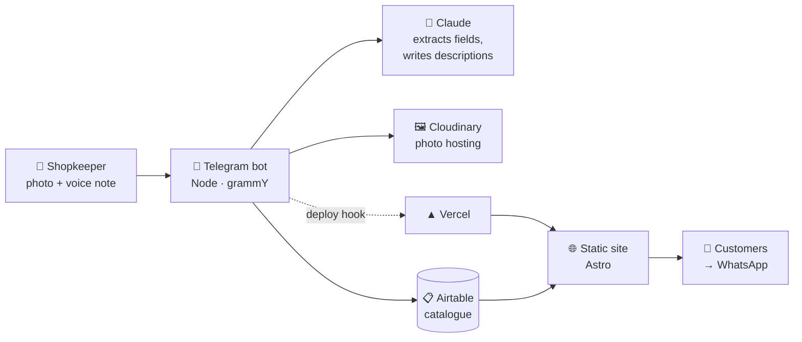

# Vetrina

**A catalogue and shop window for a small shop, run entirely from Telegram.**

[](https://github.com/zalaso/Vetrina/actions/workflows/ci.yml)
[](LICENSE)

The shopkeeper photographs a piece, says a few words about it, and taps a button.
A minute later it is online, described in decent Italian, priced, and ready to be
enquired about over WhatsApp. No dashboard, no login, no computer.

Running in production for **HD Design**, an Italian antique dealer:
**[hd-design-alpha.vercel.app](https://hd-design-alpha.vercel.app)**
· Operator's guide (Italian): **[docs/GUIDA.md](docs/GUIDA.md)**

---

## Why it exists

This was built for an antique dealer in his seventies who does not use a computer
and never will. Every off-the-shelf answer — a CMS, an e-commerce back office, a
marketplace listing form — assumes someone willing to learn an interface. He isn't,
and there is no reason he should be.

He does, however, already send photos and voice messages to his family all day long.
So the admin interface is a Telegram chat, and everything else is arranged behind it.

The interesting constraint was not the technology. It was that **the person using it
must never see an error, a form, or a decision they did not ask to make.** Every rule
in the bot follows from that: confirmations are buttons rather than typed commands,
failures are apologies rather than stack traces, and nothing changes the public site
without an explicit tap.

## How it works



A message arrives as a Telegram webhook. Voice notes are transcribed with Whisper;
the text and the photographs go to Claude, which returns structured fields plus a
short and a long description written for a gallery, not for a marketplace. Photos go
to Cloudinary, the record goes to Airtable, and a deploy hook rebuilds the site.

The public site is **fully static**. Airtable is read at build time, so a visitor's
page load never depends on a third-party API being up, and the whole thing serves
from a CDN.

## What the shopkeeper can do

Everything is plain Italian, typed or spoken, and every change is confirmed with a
button before it happens.

| Says | Result |
| --- | --- |
| *photo* + "comò piemontese, pagato 400, lo vendo a 1200" | Draft with summary → ✅ Publish / ✏️ Correct |
| "il prezzo è 1000, non 1200" | Corrects the draft in place |
| "venduto il comò" | Marks **sold** — counts towards profit, shown in the "recently sold" gallery |
| "togli la poltrona", "me la tengo", "si è rotta" | Marks **withdrawn** — disappears from the site, does *not* count as a sale |
| "cambia la foto della credenza" | Waits for a new photo, replaces or appends |
| "cosa ho in vendita?" | Short list with prices |
| "quanto ho guadagnato quest'anno?" | Sum of (sale − purchase) for the year |

Purchase prices and private notes live in Airtable and are never read by the site.

## Stack

| | |
| --- | --- |
| **Site** | [Astro](https://astro.build) 5, static output, zero client JS except a category filter and a photo gallery |
| **Bot** | Node 20, [grammY](https://grammy.dev), deployed as a serverless webhook |
| **Database** | Airtable — chosen so the owner's family can also fix things in a spreadsheet-like UI |
| **AI** | Anthropic Claude for parsing and copywriting, OpenAI Whisper for voice notes |
| **Images** | Cloudinary (free tier), with automatic resizing |
| **Hosting** | Vercel, two projects from one repository |

## Quick start

```bash
git clone https://github.com/zalaso/Vetrina.git
cd Vetrina/site
npm install
npm run dev
```

Open <http://localhost:4321>. With no configuration at all you get a **fictional
example shop** with a sample catalogue — enough to see the whole site working before
you connect anything.

To make it your own, copy `site/.env.example` to `site/.env` and set `SHOP_NAME`.
Setting it switches the site out of example mode: from that point fields you leave
empty stay empty rather than inheriting the fictional shop's details.

Setting up the bot takes longer — Telegram, Airtable, Cloudinary and two API keys.
That is what [docs/GUIDA.md](docs/GUIDA.md) walks through, step by step.

## Configuration

No business data is committed to this repository. The code is the engine; a shop is
an environment. Full reference with comments in
[`site/.env.example`](site/.env.example) and [`bot/.env.example`](bot/.env.example).

**Site** — `SHOP_NAME` is the switch; `SHOP_PHONE`, `SHOP_PHONE_DISPLAY` and
`SHOP_WHATSAPP` are then required (the build fails loudly without them, which on
Vercel means the previous deployment stays up instead of a site with broken contact
buttons). Everything else is optional and simply hides itself: no address means no
address block and no map, no biography means the "story" page drops out of the menu
and is marked `noindex`.

The wordmark and favicon are drawn from `SHOP_NAME` rather than shipped as
files, so a fresh clone has its own identity immediately: "HD Design" becomes a
large serif **HD** over a spaced **DESIGN**. Drop in a real logo by replacing
`Logo.astro` with an ``.

**Bot** — Telegram token, Anthropic key, Airtable credentials, Cloudinary
credentials, the Vercel deploy hook, and `ALLOWED_TELEGRAM_IDS`, a whitelist of
Telegram user IDs. Anyone else gets a flat "Bot privato". The OpenAI key is optional
and only enables voice notes — worth having, since speaking is easier than typing for
the intended user.

## Deployment

Two Vercel projects from this one repository, with **Root Directory** set to `site`
and `bot` respectively. The bot's `VERCEL_DEPLOY_HOOK_URL` points at the site
project, which is what closes the loop between "publish" and the page going live.

> **A trap worth knowing:** on Vercel's free plan with a private repository,
> deployments are silently rejected when the commit author is not the project owner —
> the site keeps serving the previous build with no visible error. If pushes stop
> taking effect, check that `git config user.email` matches the GitHub account that
> owns the Vercel project.

## Running costs

Everything except the AI runs on free tiers. Per operation, roughly:

| | |
| --- | --- |
| Add an item (photos analysed + descriptions written) | ~€0.02 |
| Corrections, sales, queries | < €0.01 |
| Transcribe a voice note | ~€0.002 |

For a shop adding 30 pieces a month that is **under €2/month**, and Airtable,
Cloudinary and Vercel stay free at this scale.

## Project layout

```
site/                     Astro shop window
  src/config/             the shop as configuration, read from the environment
  src/lib/catalog.ts      single entry point for data — Airtable, or sample data
  src/pages/              home · catalogue · item · story · contact
bot/                      Telegram bot
  api/webhook.js          serverless entry point
  src/bot.js              conversation flows and confirmations
  src/ai.js               prompts for extraction, correction, intent
  src/sessions.js         pending confirmations, stored in Airtable rather than
                          in memory — serverless instances do not share memory
  scripts/                one-off setup: Airtable schema, Telegram webhook
docs/GUIDA.md             setup and day-to-day guide, in Italian
```

The code, comments and UI strings are in Italian: it is the language of the shop and
of the person the software was written for.

## License

[MIT](LICENSE) © Guido Marmorini
